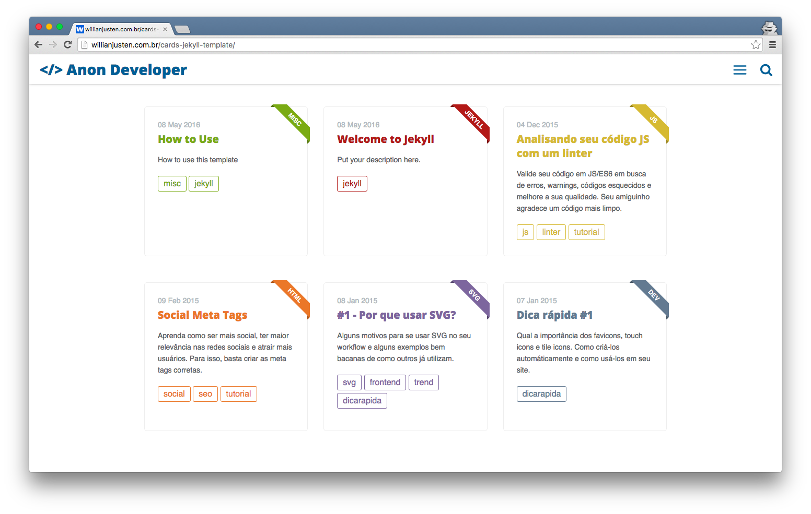

# KimSohee Portfolio


---

## What is it?
프로젝트 과정과 산출물을 가지고 포트폴리오를 만들어보았습니다. 즐겁게 봐주세요.

## Team Projects

### 1
- Role
- Team
- Platforms
- Date

- Overview
- Issue

## Skill Set Using Projects
Backend:
- ㄱ
- ㄴ

Frontend:
- ㄷ
- ㄹ

Communication:
- ㅁ

## Connect With Me
- Email
- CV

---

아래부터는 사용한 Template에 대한 정보입니다.

## Cards Jekyll Template
See the [demo here](https://willianjusten.github.io/cards-jekyll-template)

## The Theme features:

- Gulp
- Stylus (Jeet, Rupture, Kouto Swiss)
- Live Search
- Offcanvas Menu
- SVG icons
- Very very small and fast!
- Shell Script to create posts
- Tags page
- Series page
- About Me page
- Feed RSS
- Sitemap.xml
- Color Customization
- Info Customization

## Basic Setup

1. [Jekyll 설치](http://jekyllrb.com) (use the command ```sudo gem install jekyll```)
2. 템플릿 가져옵니다. [Cards Jekyll Template](https://github.com/willianjusten/cards-jekyll-template/fork)
3. 로컬 환경에 클론합니다.
4. `_config.yml`파일을 나에게 맞게 수정합니다.
5. 샘플 포스트에 사용하는 방법이 기록되어 있습니다. 확인하세요. `_posts`
7. **Remember to compile your assets files with Gulp.**

## Header Name

[src/styl/_header.styl](src/styl/_header.styl). 해당 경로에서 header 이름을 변경할 수 있습니다.

## Color customization

All color variables are in [src/styl/_variables.styl](src/styl/_variables.styl). To change the main color, just set the new value at `main` assignment. Another colors are for texts and the code background color.

## Theme Colors

Every post has a main color that is defined on [src/styl/_theme-colors.styl](src/styl/_theme-colors.styl). Just create a new color with the prefix `post-` and define your main-class: 'css' and color: '#2DA0C3' on every post you create.

## Creating posts

You can use the `initpost.sh` to create your new posts. Just follow the command:

```
./initpost.sh -c Post Title
```

The new file will be created at `_posts` with this format `date-title.md`.

## Front-matter 

When you create a new post, you need to fill the post information in the front-matter, follow this example:

```
---
layout: post
title: "Falando sobre RSCSS"
date: 2016-02-07 18:48:16
image: '/assets/img/rscss/rscss.png'
description: 'Escrevendo CSS sem perder a sanidade. Aprenda uma metodologia que pode salvar muitas dores de cabeça.'
main-class: 'css'
color: '#2DA0C3'
tags:
- css
- metodologia
- frontend
categories:
twitter_text: 'Escrevendo CSS sem perder a sanidade.'
introduction: 'Escrevendo CSS sem perder a sanidade. Com essa introdução, Rico St. Cruz o criador chama a atenção de todos sobre uma metodologia melhor para se escrever CSS.'
---
```

## Running the blog in local

In order to compile the assets and run Jekyll on local you need to follow those steps:

- Install [NodeJS](https://nodejs.org/) (remember to use the latest version)
- Run `npm install`
- Run `npm install -g gulp gulp-cli`
- Run `gulp`

## License

This theme is free and open source software, distributed under the The MIT License. So feel free to use this Jekyll theme on your site without linking back to me or using a disclaimer.

If you’d like to give me credit somewhere on your blog or tweet a shout out to [@willian_justen](https://twitter.com/willian_justen), that would be pretty sweet.
